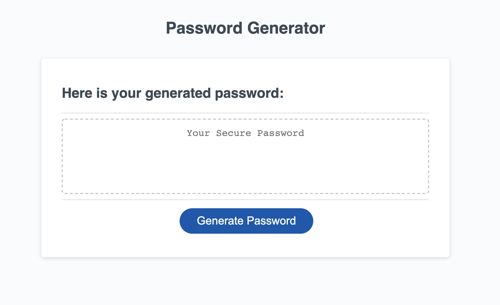

# Password-Generator

This project was designed as a homework assignment for GWU's coding bootcamp. 

This application focuses on the use of Javascript to generate a random, secure password for the user. 

### Summary
* HTML and CSS and Javascript documents create a random password generator 
* This project emphasizes the use of using Javascript to make dynamic changes to an HMTL document

### This project has the following features: 
* A generate button
    * This will send the user a series of prompts and confirms
    * After user data is collected, a random password will be generated using Javascript

* A textarea
    * This textarea will display the users password once it is generated

### Project Requirements: 
* The user will be prompted to choose from the following password criteria: 8 and 128 characters
* The user will recieve a confirm for: 
    * Password containing lowercase, uppercase, numbers, and/or special characters.
    * This will need to randomly generate a selection or randomly select array data, so math.random and math.floor will need to be used.     
* The application should validate user input and ensure that at least one character type is selected.
* Once all prompts are answered, the user will be presented with a password matching the answered prompts. 
    * Event listener will determine the password output with function to populate the value into the text area.

### This project has script features of:
* Variable declaration area 
* An event listener (onclick) called generatePassword
    * This will prompt the user for input between 8 and 128 characters
    * This variable is changed to an interger using ParseInt()
    * This will validate that the input is a number within the range
    * This then uses the input to determine the types (or choices) or letters of characters used, using an if statement
    * This then assigns values to the variables using arrays for alphabet, number or character
* A for loop will loop through the enter prompt until it reaches the number entered by user. 
* A password variable takes the value from the for loop, and converts it to a string. 
* The string value then populates into the text area for the user.

